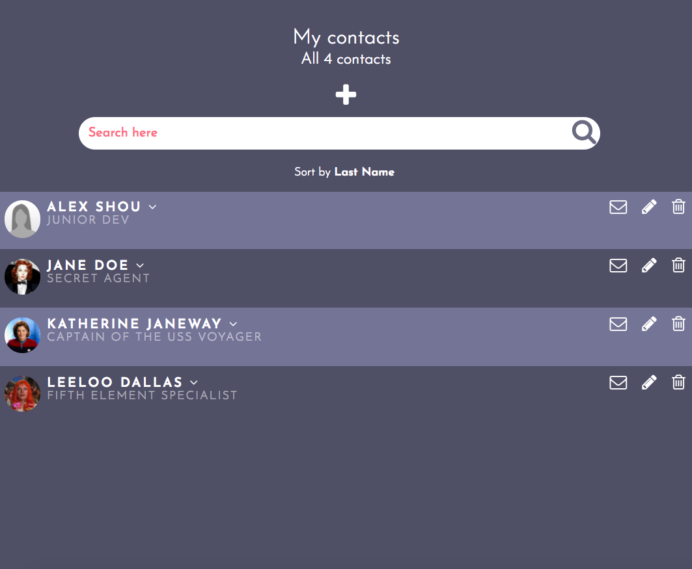

# Contact Book with React Application Documentation
This is a single page application that mimics a contact book and list a user's contacts. React.js and JSX are used to build the application UI. Axios is used for the API call to the server. This is a mobile and tablet friendly web application.

The web application is available online [here](http://alexshoucri.com/contacts-react/build).



## Components
&nbsp;```<App />```

&nbsp;```<Contact />```

&nbsp;```<ContactList />```

&nbsp;```<AddContact />```

&nbsp;```<FormContact />```

&nbsp;```<FormButtons />```

&nbsp;```<Header />```

&nbsp;```<Search />```

&nbsp;```<ViewFullProfile />```

##Features


## API Contracts
